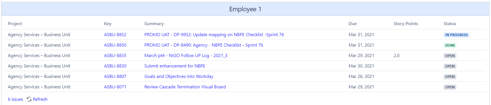

# JiraQueryLanguage
Documentation for advanced queries of the JIRA Query Language to create useful dashboards in Confluence


## Open Task Pool, Due Today
```SQL
duedate < 1d AND duedate >= 0d AND assignee IN ("MNGR1") AND project = "Agency Services – Business Unit"
OR
duedate <= 0d AND assignee IN ("MNGR1") AND status IN ("Open", "In Progress")
```

``SQL
duedate < 1d AND duedate >= 0d AND assignee IN ("EMP01") AND project = "Agency Services – Business Unit"
OR
assignee IN ("EMP01") AND project = "Agency Services – Business Unit" AND status = "In Progress" 
OR
resolutiondate < 0d AND resolutiondate > -1d AND assignee IN ("EMP01") AND status IN ("Done", "Blocked")
OR
duedate <= 0d AND assignee IN ("EMP01") AND status = "Open"
OR
assignee IN ("EMP01") AND resolution = "Unresolved" AND updatedDate <= 0d AND updatedDate > -1d AND status IN ("Blocked", "Done")
```
